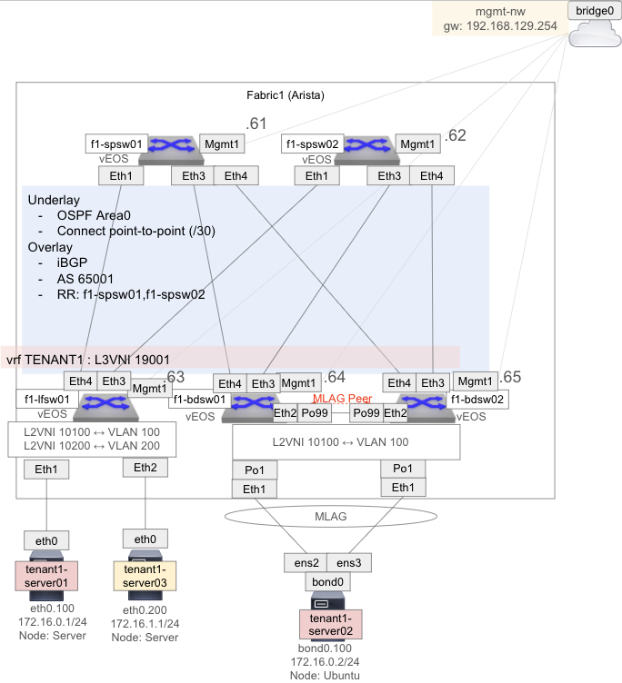
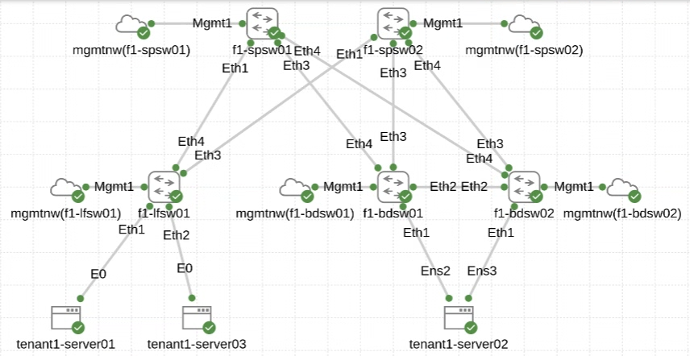

# Arista Fabric 検証

Arista vEOS を CML に入れて構築を試した結果のログ

## 構成概要

下記のような構成を構築する例

## Node Definition

[Cisco DevNet CML Commnuity Node Definitions Arista vEOS](https://github.com/CiscoDevNet/cml-community/tree/master/node-definitions/arista/veos) を参考に Management1 などの定義を修正したものを下記リンクで共有する

[vEOS.yaml](../node_definition/vEOS.yaml)

CML の `TOOLS` の `Node and Image Definitions` の中にある、`IMPORT` で上記 YAML をインポートする

## Image Definition

[Arista サイト](https://www.arista.com/en/support/software-download) からダウンロードする。ユーザ登録が必要。

CML の `TOOLS` の `Node and Image Definitions` の中の `IMAGE DEFINITIONS` タブから `MANAGE` をクリックして `UPLOAD IMAGE` して、`Node Definition` から `vEOS` を選択して定義する

## CML 構築

Arista のノード定義にコンフィグ保存まで定義ができてないので、ワークベンチ作成まで YAML で実施して、機器の Config は手動登録となる

下記リンクの定義でワークベンチを作成する
[Arista_EOS_fabric.yaml](./Arista_EOS_fabric.yaml)

各機器はコンソールアクセスで入力後に SSH でログインして残り設定を流し込む流れとなる ([config](./arista_config/))
