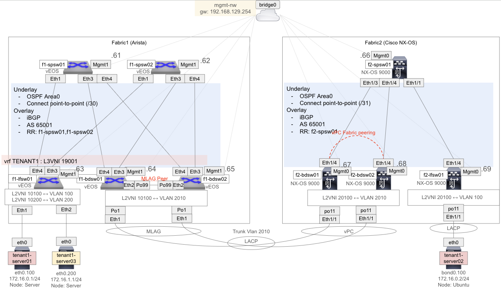
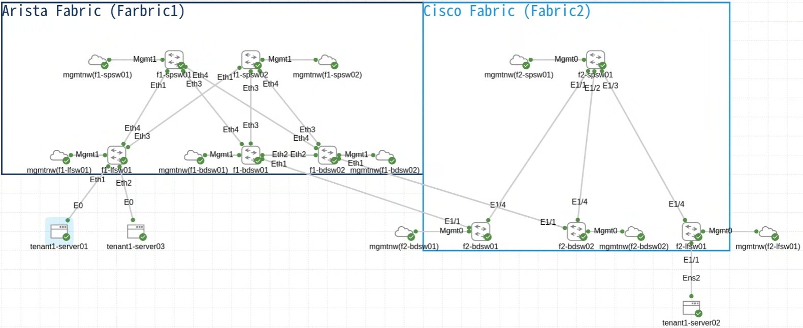

# Arista Fabric + NX-OS 9K Fabric Border 接続検証

Arista vEOS Farbic と Cisco N9K Fabric 間を Border 間で接続する検証

注釈： Fabric 間の接続構成/実施可否含め正解は分かってない

## 構成概要

下記のような構成を構築する例 (実行環境のメモリ問題で冗長を一部削って試験している)





## CML 構築

下記リンクの定義でワークベンチを作成する

[Arista_EOS_fabric_And_Cisco_NX9K_fabric.yaml](./Arista_EOS_fabric_And_Cisco_NX9K_fabric.yaml)

Arista のノード定義にコンフィグ保存まで定義ができてないので、ワークベンチ作成まで YAML で実施して、Arista vEOS 機器の Config は手動登録となる

[arista単体fabric](../arista/README.md) に倣って Arista vEOS 機器の設定後に `f1-bdsw01` と `f1-bdsw02` に下記を修正する (サーバ接続していたところを Fabric 接続に切り替えている。VLAN は Fabric 間で変更できるように別の VLAN-ID にあえてして試験している)

```sh
conf t
!
no interface Vlan100
!
no vlan 100
!
vlan 2010
   name TENANT1-SERVER-SEG1
!
interface Vlan2010
   vrf TENANT1
   ip address virtual 172.16.0.254/24
!
interface Port-Channel1
   description f2-bdsw01/02 Po11
   switchport trunk allowed vlan 2010
!
interface Vxlan1
   no vxlan vlan 100 vni 10100
   vxlan vlan 2010 vni 10100
!
router bgp 65001
   vlan-aware-bundle L2VNI
      vlan 100-2999
!
interface Ethernet1/1
  description f2-bdsw01/02 Eth1/1
end
```

設定後の Config 全体は下記に保存している

[config backup](./arista_config/config_back/)
