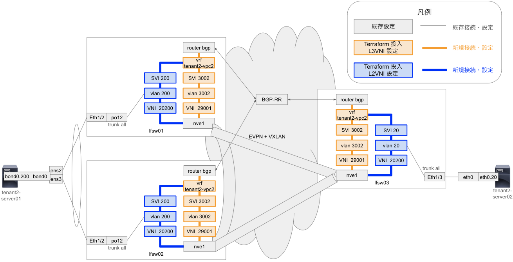

# env cml vni

## 概要

CML で構築された既存 EVPN+VXLAN 構築済み環境に Overlay を追加して IaC 管理する

## 概要図

## CML 設定

下記ファイルが VNI 設定前の CML 設定ファイル

`../cml_yaml/leaf_spine/Leaf-Spine-Test3_VNI_Before.yaml`

設定後は下記の設定

`../cml_yaml/leaf_spine/Leaf-Spine-Test3_VNI_After.yaml`
